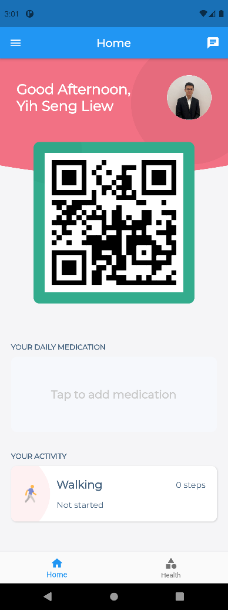
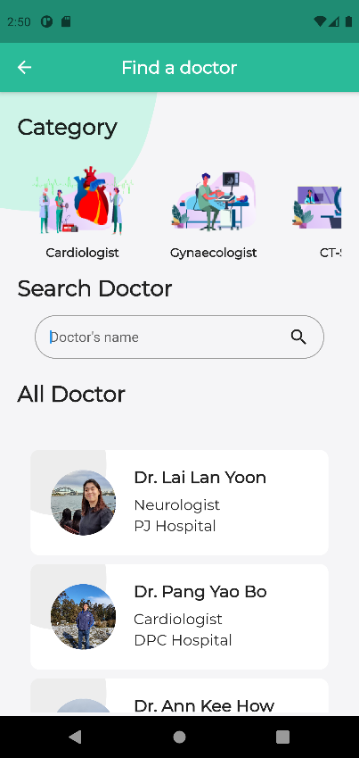

# HealthGuard for Android  & iOS
  

### What is HealthGuard?
HealthGuard is a revolutionary app that centralizes all useful features that you might be able to find in other apps into one singular app. There are many useful features that are readily available on the app which can be enjoyed by users.  HealthGuard takes useful features that are available on other healthcare apps, improve it and make it very user friendly for the users. It also has a revolutionary feature called e-medical health report. This report can be retrieved by doctors using the QR scanner feature in the app. All they have to do is scan the QR code that comes with every patients’ account and their previous medical records will be displayed. Finally, HealthGuard also aims to save precious time in case of emergencies. For example, before anesthesia is given to the patient, doctors have to run a blood test on the patient to make sure that they won’t get an allergic reaction from the anesthesia as it can be deadly. HealthGuard can save the doctor that kind of time in case of an emergency by getting their e-medical health record and knowing the allergies they might have beforehand.

### Technology
This application has been fully developed using Flutter, an open source cross-platform framework that allows developers to only prepare a single version that reacts the same in both the leading mobile OS in the market: Android and iOS. The implementation of this cross-platform framework has encouraged us, the developers to practice a fast paced development of application as all necessary debugging and development work were to be done only on a single codebase. Besides, this application has been incorporated with the latest state-of-the-art Backend-as-a-Service (BaaS) provider, Firebase where it handles all the backend transactions being carried out within this application. The implementation of Firebase has allowed transactions of data, read and write to be perform rapidly under a reasonably smooth Internet connection. 

# Screenshots

  
  
  
  

  
  
  
  

# Prerequisites
### Selection of IDE
a) Windows
* The preferred IDE to run this code is Android Studio as it has an extensive range of tools available including an Android Emulator where users can run their application on while debugging the source code.
* Installation of Android Studio can be accessible through this link : https://developer.android.com/studio?gclid=Cj0KCQjw9_mDBhCGARIsAN3PaFMeaXZcM6NR-zA4MPqwjbdndZh-xirXtVcdf4tG1yFUYiqkAj5LVD4aAvlwEALw_wcB&gclsrc=aw.ds

b) MacOS
* The preferred IDE to run this code is Xcode where it supports the execution of iOS simulator.
* Installation the latest stable version of Xcode can be accessible through this link: https://developer.apple.com/xcode/
* Configuration of Xcode can be done as follows in the command line: 

		$ sudo xcode-select --switch /Applications/Xcode.app/Contents/Developer
		$ sudo xcodebuild -runFirstLaunch
	
> However, Window users will only be capable of running .apk files in their machine as Window OS only supports Android Emulator. Whereas for the MacOS users, they are able to run both the .apk file and .app file as MacOS supports both the Android Emulator and iOS Simulator

### Installation of Emulators
a) Android Emulator
*  To install, head to Android Studio (Both Window and macOS). Select the Android Emulator component in the SDK Tools tab of the SDK Manager. Select the SDK Platform you wished to download, then click on Apply which the Download will start immediately.
* Then head over to AVD Manager within the Tools section located within the tab. Select the button Create Virtual Device followed by the configuration of all your desired settings.

b) iOS Simulator
* On your Mac, find Simulator via Spotlight or by using the following command:

		$ open -a Simulator
* Make sure your simulator is using a 64-bit device(iPhone 5s or later) by checking the settings in the simulator's Hardware > Device menu.
* Depending on your machine's screen size, simulated high-screen-density iOS devices might overflow your screen. Grab the corner of the simulator and drag it to change the scale. You can also use the Window > Physical Size or Window > Pixel Accurate options if your computer's resolution is high enough.

### Installation of Flutter
The version of Flutter that has been used is 1.26.0-1.0.pre.
a) Windows
* Accessible via: https://storage.googleapis.com/flutter_infra/releases/dev/windows/flutter_windows_1.26.0-1.0.pre-dev.zip
* Extract the files to the desired location.
* Right-click on Extracted files: flutter\bin\dart.bat and run as administrator.
* Head to System Environment in your machine, select Environment Variables.
* Select Path in User variable then click on New.
* Enter the path which leads to the bin folder within the Flutter file you have extracted just now
* Head to Android Studio, select File in the Toolbar.
* Select Settings followed by Language & Frameworks.
* Select Flutter.
* In the Flutter SDK path section, please enter the path that direct to the files that you have previously extracted.
* After that, click on OK.

b) MacOS
* Accessible via:
https://storage.googleapis.com/flutter_infra/releases/dev/macos/flutter_macos_1.26.0-1.0.pre-dev.zip
* Extract the files in the desired location, for example:

		$ cd ~/development
		$ unzip ~/Downloads/flutter_macos_2.0.5-stable.zip
* Add the flutter tool to your path:

		export PATH="$PATH:`pwd`/flutter/bin"

* After that, you are ready to run Flutter commands.

### Installation of  Git
a) Windows
* Go to this link:
[https://git-scm.com/download/win](https://git-scm.com/download/win)
* Select the version based on your machine's information.
* Extract the files followed by running of the installer.

b) MacOS
* In Xcode's Command Line Tools. Run:

		$ git --version
* It checks the presence of Git in the machine and will prompt users for installation if Git has not been installed in the machine.

### Working on Real Devices
a) Android Devices
>Applicable for both users running Windows and MacOS
* Connect the Android device to the machine via a USB cable
* On the Android device, go to settings, scroll to the bottom and select About Phone
* Select software information and tap Build number 7 times. By doing this, it should enable developer mode on the phone.
* Return to the main settings page, scroll to the bottom and Developer Options should be made available.
* In the Developer Options, turn on USB debugging.
*  Once successfully connected, the Android device is now ready to run the app.

b) iOS Devices
>Only applicable for users running MacOS
* Connect your iOS device to your machine running MacOS via a cable.
* Choose the device that has been connected in the run destination menu in Xcode
* Add your Apple ID in Accounts preferences and assign the project to a team on the Signing & Capabilities pane of the project editor.
* Once successfully being paired, the iOS device is now ready to run the app.

### Cloning of HealthGuard Repository on Github
* Using the Command Line Tool in your desired IDE, run:

		git clone https://github.com/liewyihseng177/HealthGuard.git
* This will allow the latest version of source code to be cloned into the workspace.
* If you are facing any issue on cloning this file, do drop me an email at liewyihseng177@gmail.com as this repository is currently still in private mode.
* After cloning, you are required to type the following code in the terminal to retrieve all the necessary open source packages.
		
		flutter pub get

# Running of Source Code
>After having all the prerequisites done, you are now ready to run the cloned source code.

### Android Studio
##### First Run
* In the toolbar, select Run the followed by Edit Configurations.
* Click on the + in the top-right corner of the popup screen to add a new configuration.
* A dropdown will be made available then click on Flutter.
* Give the configuration a name then input the path to the file main.dart within the cloned repository.
* Click OK
* Launch the desired devices, either by connecting to a real device or a virtual device of your choice through the AVD manager.
* Once Android Studio has detected the device you have selected, click on the run icon present in the toolbar.
* The application in the device once it has finished building. 

##### Consecutive Runs
* Launch the desired devices, either by connecting to a real device or a virtual device of your choice through the AVD manager.
* Once Android Studio has detected the device you have selected, click on the run icon present in the toolbar.
* The application in the device once it has finished building. 

### Xcode
* Make sure that the terminal is in the right directory that has access to the file main.dart in the cloned repository.
* Launch the Simulator or connect to an iOS device accordingly.
* Once successfully connected, enter flutter run in the terminal which will lead to the running of the application. 

# Running of Test Cases
>After having all the prerequisites done, you are now ready to run the test cases in the cloned source code.

### Make sure the run configuration has been properly created.
* Click on Edit Configuration on the toolbar.
* Select the + on the top left corner.
* Scroll the lists to look for Flutter Test, then path the Flutter Test to the file that you are testing.
* Once completed, you can now run your desired test cases.
